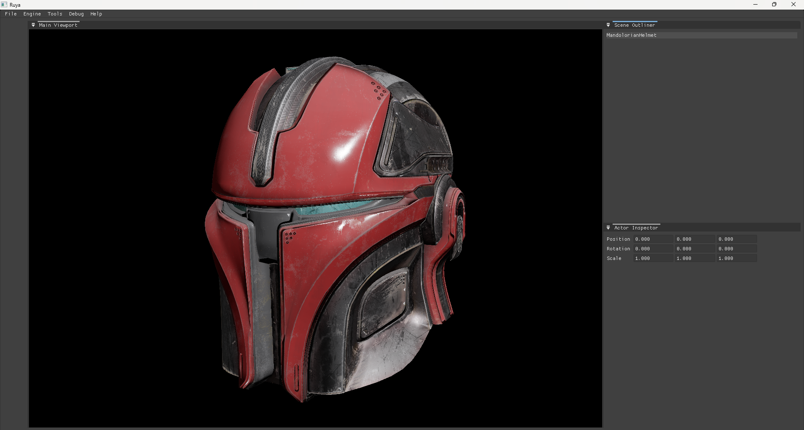

**Ruya Engine** is a game engine developed for modern graphics and game technologies. Ruya is built on cutting-edge research and advancements in the fields of graphics and game development.

### Features:
- Vulkan 1.3-based render backend for modern graphics techniques
- PBR (Physically-Based Rendering) shader model for highly realistic materials
- Deferred Shading for managing multiple light sources
- A data-driven approach to complex and large-scale game systems by using an Entity-Component-System (ECS) based game framework.

### Roadmap:
- Real-time global illumination
- Real-time ray-traced shadows
- Real-time ray-traced reflections
- Image-based lighting
- Fully-featured level editor with a WYSIWYG scene viewport

### ScreenShots:

